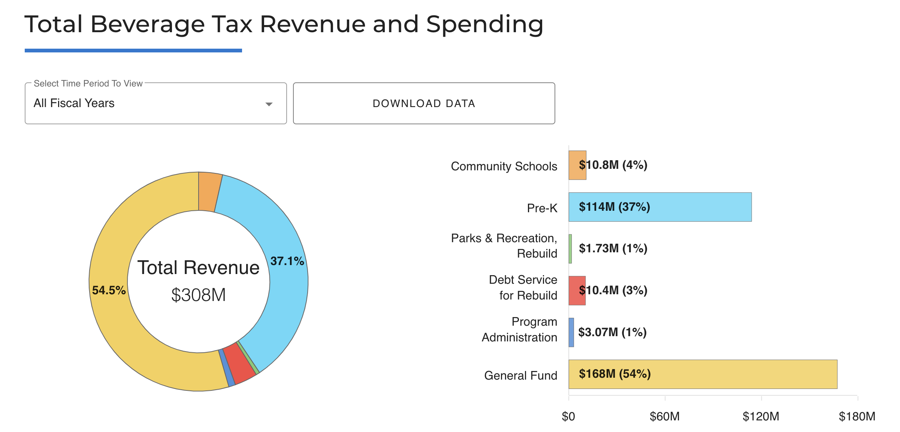
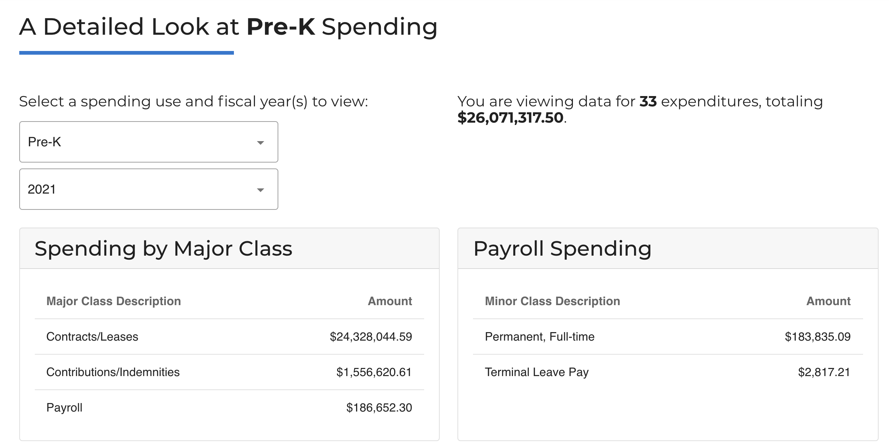

# Tracking Beverage Tax Revenue and Spending

The code behind the interactive dashboard for Philadelphia's soda tax revenue and spending.

Check out the interactive visualization [here](https://controller.phila.gov/philadelphia-audits/data-release-beverage-tax/).





## Tools

The application is built using a combination of open-source tools, including
[vue](https://github.com/vuejs/vue), [vuetify](https://github.com/vuetifyjs/vuetify), and [ApexCharts](https://github.com/apexcharts).

## Development

### Project setup
```
yarn install
```

### Compiles and hot-reloads for development

Load data from the staging database:
```
yarn run serve-staging
```

Load data from the production database:
```
yarn run serve-prod
```

### Compiles and minifies for production

Load data from the staging database:
```
yarn run build-staging
```

Load data from the production database:
```
yarn run build-prod
```
